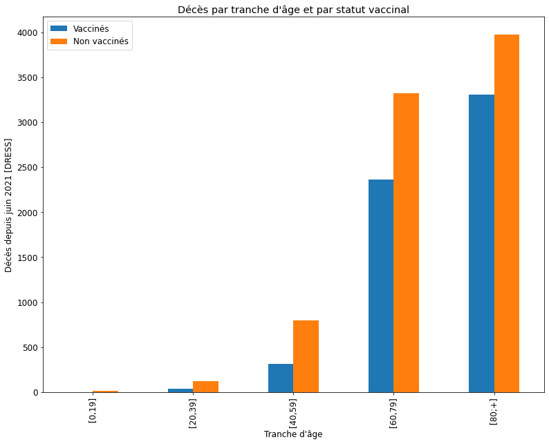
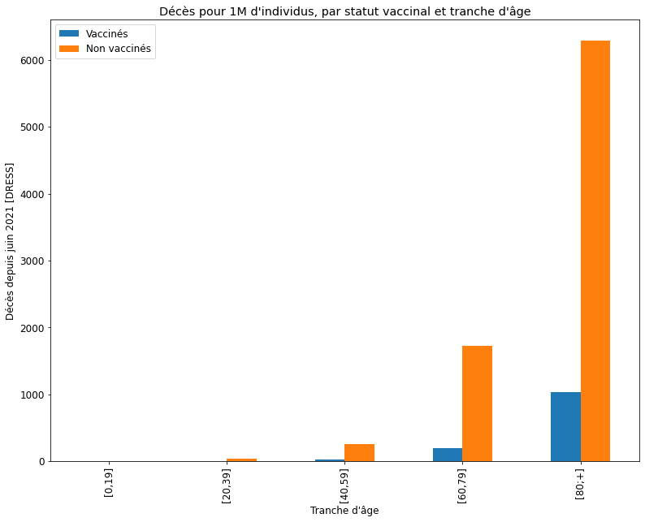
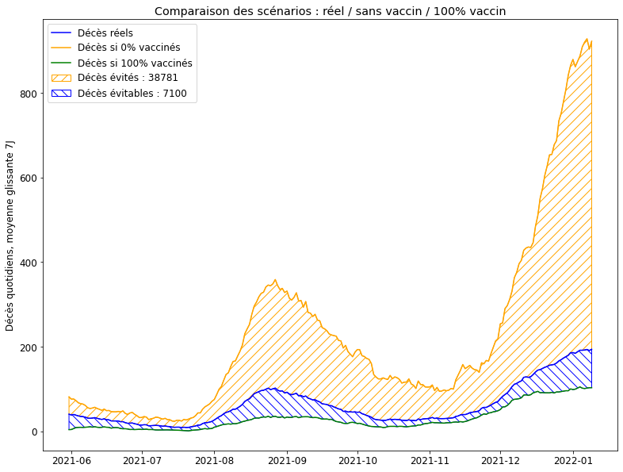
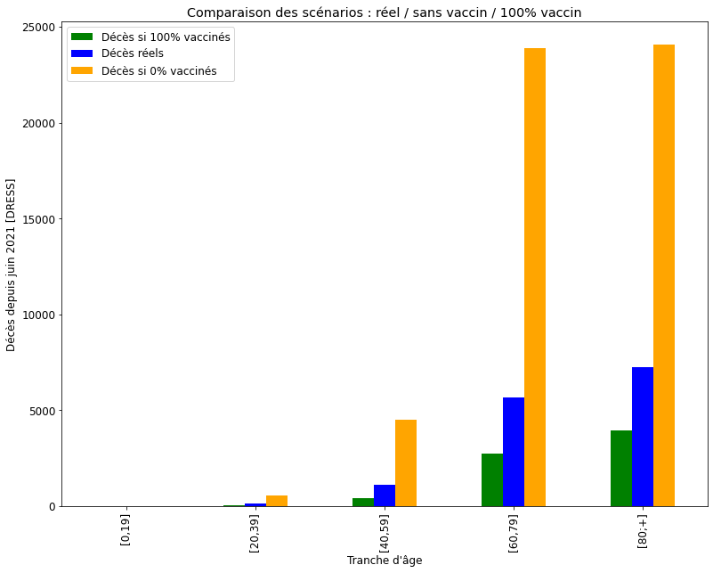

# Analyse des décès covid en hopital, par statut vaccinal 

## Résumé

Cette feuille de calcul [Jupyter](https://jupyter.org/) analyse les données de décès de la DREES par statut vaccinal et par âge, et tente d'évaluer les décès évités par la vaccination, et ceux qui auraient pu l'être avec une couverture vaccinale complète.

## Données

Les données proviennent du site de la DREES. Elle comportent les décès depuis juin 2021, par statut vaccinal, dat et tranche d'âge

https://data.drees.solidarites-sante.gouv.fr/explore/dataset/covid-19-resultats-par-age-issus-des-appariements-entre-si-vic-si-dep-et-vac-si/information/

## Méthodologie 

Pour chaque tranche d'âge, chaque statut vaccinal et chaque date, la DREES fournit les effectifs du groupe correspondant (age et statut vaccinal), à date. Ceci permet de calculer une mortalité journalière pour chaque sous groupe.

Il est alors possible de simuler des scénarios de couverture vaccinale (0% et 100%) appliquant la mortalité d'un sous groupe à l'autre, pour une même tranche d'âge.

## Limitations

Ces calculs reposent sur l'hypothèse que la différence de mortalité des groupes vaccinés et non-vaccinés dépend essentiellement de leur statut vaccinal. Le facteur de confusion "âge" est pris en compte par la strafification par âge déjà appliquée par la DREES. 

D'autres facteurs de confusion peuvent néamoins subsister:

* **Comorbidités** : Chez les plus jeunes surtout (0-19 ans), les individus présentant des comorbidités ont été vaccinés en priorité. L'ignorance de cette corrélation tend à sous estimer l'impact positif de la vaccination.

* **Classes sociales** : Les classes populaires sont à la fois moins plus vulnérables et moins vaccinées que le reste de la population. [1](https://www.cdc.gov/mmwr/volumes/70/wr/mm7022e1.htm) [2](https://www.huffingtonpost.fr/entry/vaccination-la-richesse-ou-les-diplomes-insuffisants-pour-expliquer-le-choix-de-ceux-qui-decident-de-ne-pas-le-faire_fr_61166e34e4b07c1403142492). L'ignorance de cette corrélation tend à surestimer l'impact positif de la vaccination.

* **Transmission** : Cette étude ne considère pas l'effet de la vaccination sur la transmission ([évalué à 40% environ](https://www.france24.com/en/live-news/20211124-vaccines-reduce-covid-transmission-by-40-who)). L'ignorance de cet tend à sous estimer l'impact positif de la vaccination.

# Résultats 

Au total, la vaccination a permis d'éviter plus de 38000 décès depuis juin 2021. 
Sur les 14200 décès répertoriés par la DREES sur cette période, la moitié (7100) auraient pu etre évités par une couverture vaccinale complète. 

## Graphes

### Décès par tranche d'âge et statut vaccinal

### Décès par tranche d'âge et statut vaccinal, normalisés pour 1 million d'individus

### Scenarios 100% vaccinés / 0% vaccinés

#### Série temporelle

#### Bilan par tranche d'age

## Tableau

| age       | décès non-vax | décès vax | décès si 0% vacciné | décès si 100% vaccinés | décès évités | décès évitables | Efficacité du vaccin (%) |
|-----------|---------------|-----------|---------------------|------------------------|--------------|-----------------|----------------------|
| 0-19      | 18            | 4         | 24                  | 12                     | 2            | 9               | 66                   |
| 20-39     | 125           | 38        | 559                 | 52                     | 395          | 111             | 91                   |
| 40-59     | 796           | 315       | 4513                | 411                    | 3401         | 699             | 91                   |
| 60-79     | 3324          | 2365      | 23884               | 2737                   | 18195        | 2951            | 89                   |
| 80+       | 3971          | 3306      | 24066               | 3947                   | 16788        | 3330            | 85                   |
| **Total** | 8234          | 6028      | 53046               | 7159                   | **38781**    | **7100**        |                      |

# Code 

Le code est disponible sur Github :
https://github.com/raphaeljolivet/drees-deces

# Auteur

Raphaël Jolivet : https://mamot.fr/@RaphJ

# Licence

Cette feuille de calcul est distribuée sous [licence CC-By](https://creativecommons.org/licenses/by/4.0/)

